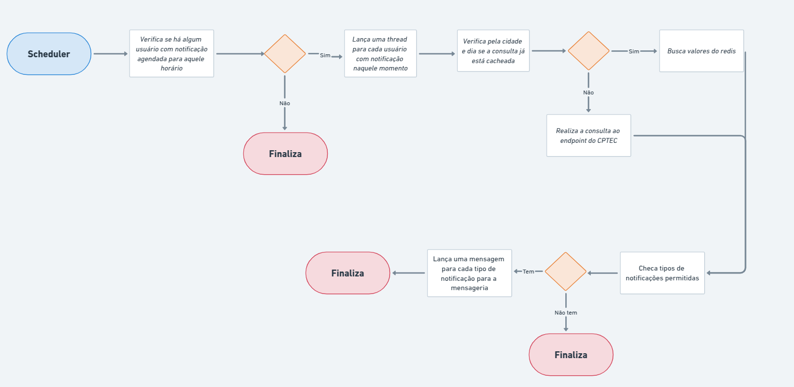

# Ecossistema de notificação (notification-eco)

### To-Do
- [X] Criar um cadastro básico de usuário na api-clima definindo que tipos de notificações ele aceita
- [X] instalar RabbitMQ no docker compose e configurar
- [X] Criar service para interagir com a mensageria
- [X] Instalar scheduler para rodar cron
- [X] Feature para rodar integrada com o cron e selecionar usuários que devem receber notificações naquele momento
- [X] Feature de busca de clima por usuário
- [X] Feature para lançar notificação para a mensageria
- [X] Feature de cachear clima buscado no dia para aquela cidade especifica
- [ ] Criar base da api-notificações
- [ ] Criar service para interagir com o serviço de mensageria
- [ ] Feature para disparar as notificações para os lugares corretos
- [ ] Configurar docker para rodar sozinho main das api`s
- [ ] Configurar docker para clonar .env.example para .env

### Como Executar 1.0
- Na pasta principal, rodar ```docker compose up -d```

### Estrutura

- Api`s : Golang 1.23.5
- Mensageria : RabbitMq
- Banco de Dados : Mysql 8.0
- Cache : Redis
- Ambiente : Docker

### Estrutura Base


### Api-clima estrutura


### Fluxo de notificação api-clima


### Fluxo de notificação api-notificações


### Futuro

- [ ] Integrar com keycloack para gerenciamento de usuários
- [ ] Integrar com serviço de socket para mensagens em real time
- [ ] Integrar com demais serviços para disparar os demais tipos de notificações
- [ ] Rota para enviar notificação na hora para usuário